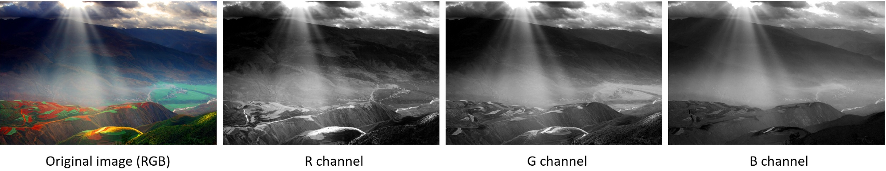

# 基本概念

## layer

层，可以代表输入层，隐藏层，输出层等

## channel

通道，用于表示输入层的结构，例如输入层输入的是一张彩色的图片，就意味的输入层是三通道的，分别是R，G，B。

## feature map

特征图与channnel是等价的概念，

## kernel

卷积核，用于过滤具体特征。泛指二维的权重矩阵

## filter

过滤器由一个或多个卷积核组成。泛指三维结构

## different between kernel and filter

kernel泛指一个二维的权重数组，而filter是指一个或多个kernel堆叠在一起的三维结构。

对于灰度图来说，他的输入就是一通道的，所以就用一个2D的过滤器就可以操作，此时filter与kernel是相同的。

但是对于彩色图来说，他的输入是三通道的，用一个2D的过滤器已经不能解决这个问题了，所以要用一个3D的过滤器，其中堆叠三个卷积核。

